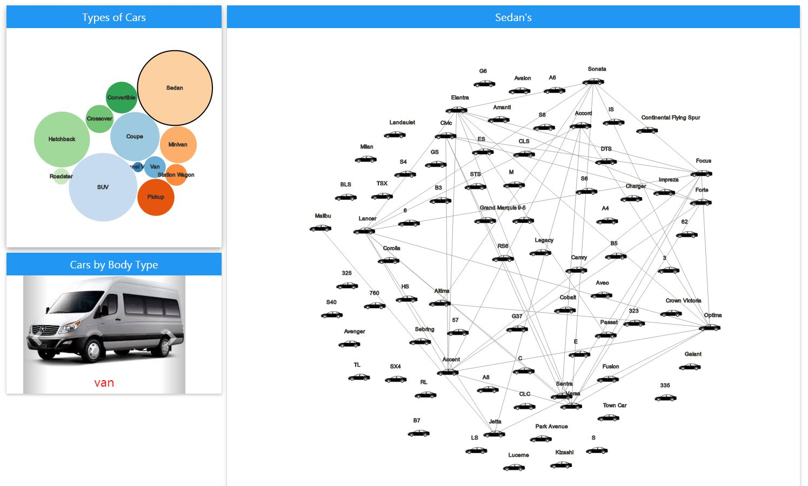
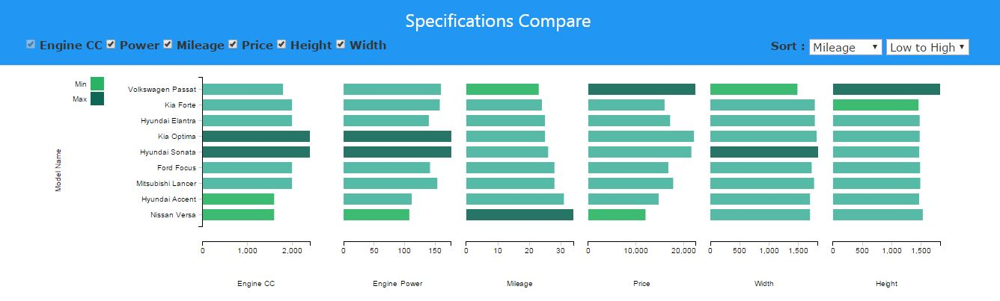

# FindMyCar

A website which displays similar cars available in the market, different visualizations are presented to the user to compare identical features.

[Live Demo](http://www.cs.odu.edu/~rgudipati/FindMyCar/index1.html)

### Data Collection
The data for the project is obtained by scraping 'cars.com' and 'truecars.com' for all the released models in years 2010 to 2014. Websites are scrapped using BeautifulSoup library. Additional data is fetched from CarQuery API and nhtsa.gov.   

### Data Refining
Tools like [Open Refine](http://openrefine.org/) were used to clean the obtained data and convert the huge data into small different files. If the data was left as a single file, it takes longer time to load the plots on the site. To overcome this, the data was split into different files, which would make it easier to load different plots.

### Plots used to visualize data

**1. Bubble chart**
This was used to visualize all the types of cars released in the specific year. The size of bubble depends on numbers of cars in the given type of car.

**2. Network Chart**
This is used to visualize the cars with similar features in the selected type of car. The cars with similar drive types, engine type, engine position, fuel types and so on are connected to each other. 

**3. Horizontal bar chart**
This chart can be used to compare all the cars which are similar in some features and some features which differ. Various sorting options are provided to sort and select the features which need to be compared.

**Several other plots were used to visualize the data which is live on the above mentioned site.**
